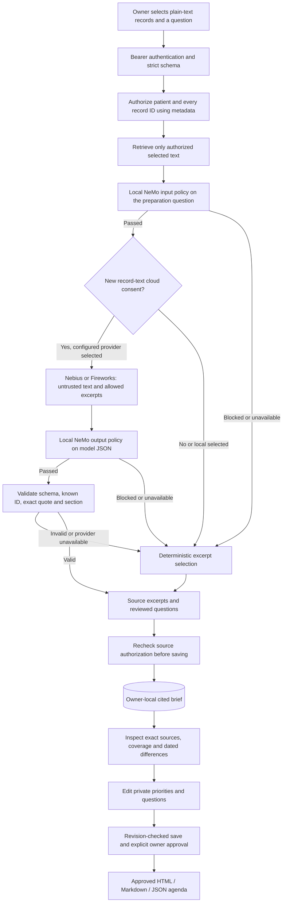

# Architecture and data boundaries

Pausewell contains two workflows behind one authenticated, single-owner FastAPI service. **VisitPrep is the primary Week 6 application; Watch check-ins are secondary.** Their cloud consent and persistence rules differ.

## VisitPrep

The LangGraph stages are `authorize → retrieve → model → validate → brief`. Authentication precedes the graph; the graph checks the server-bound owner and patient before reading record text. A request cannot supply a role, owner or tool definition. Every selected ID must belong to the authorized workspace, including mixed-ID requests. The second synthetic user's separate-principal record is an authored isolation-test fixture, not a production multi-user account system.

Imports are bounded plain text: at most 6,000 characters per record, 40 records and 120,000 text characters in the workspace. A brief accepts at most 10 records and 24,000 text characters. Documentation examples describe a person preparing for an appointment and a second synthetic user for isolation tests. Their records are authored inventions, not the user's health data. Frozen reports and screenshots retain their originally captured labels; documentation uses generic descriptions. Stable legacy IDs remain technical regression keys. Mixed or non-synthetic imports display **Your record workspace**; record subject identity is not verified.

With new per-request consent, the provider receives actual selected record text, titles, dates, source IDs, the question and candidate exact excerpts. Documents and questions are marked untrusted. There is no URL-fetching, shell, messaging, prescribing or arbitrary tool executor. This is selected-record retrieval, not semantic vector search or OCR.

[NeMo Guardrails 0.24.0](NEMO-INTEGRATION.md) executes local custom input/output actions through explicit `LLMRails.check_async()` checks with no configured model. The input policy checks the preparation question, not every document; blocked or unavailable input checks prevent cloud selection while retaining the validated local-brief path. The output policy checks raw model JSON before the mandatory exact-source validator. Ephemeral per-check engines avoid carrying conversation history across requests. These rails do not grant permissions, execute external tools or establish source truth.

The model can select up to eight `{record_id, quote, section}` objects. Code rejects extra fields, unknown IDs, altered/unsupported quotations, duplicate evidence, incorrect sections and invalid response envelopes. It adds trusted source metadata and fixed clinician-question templates. Obvious instruction-like excerpts are excluded by a supplementary bounded filter; that filter is not proof of comprehensive prompt-injection detection. Local fallback is labeled honestly. Exact quotation does not establish source truth, relevance or clinical completeness.

Records are immutable after import. Deletion removes dependent saved briefs and future exports. Authorization is rechecked after inference before saving, so a source deleted during a model call cannot create a stale brief. Already downloaded exports or data already sent to a provider cannot be recalled. Saved briefs are evidence artifacts; they are not conversational-memory messages fed into subsequent prompts.

Per-record coverage reconciles eligible passages, brief selections, separately displayed differences, omissions and excluded segments. Dated medication/allergy comparisons use limited text patterns and retain both exact source entries; they do not determine the current medication, correct dose or complete clinical conflicts. These additional passages are separate from the eight-fact selector cap and retain source authorization.

The private agenda supports up to three priorities and three questions, each at most 300 characters. Saving uses an expected revision, returns HTTP 409 for a stale update and invalidates previous approval when a draft is edited. Explicit approval binds to the saved version. Approved HTML, Markdown and JSON exports preserve source identifiers, quotations and scope notices. Agenda text is not sent to the model or normal telemetry. Source deletion, erase and retention pruning revoke dependent agendas and future exports.

Printable HTML escapes user/source text and includes a fixed stylesheet, without scripts or external resources. CSP permits the exact stylesheet's SHA-256 hash rather than arbitrary inline styles. The browser preview uses an iframe sandbox without script permission; the app's own static JavaScript controls the print interaction. These browser controls complement authentication and output validation.

## Watch check-ins

The iPhone queries read-only HealthKit and CoreMotion, computes a personal comparison and sends a bounded recent window over HTTPS. The experimental `signal-v1` policy requires inactive exercise context, stationary movement, no sleep, no workout within 45 minutes, seven baseline days, twenty eligible samples, a baseline updated within seven days and fresh unique readings. Three recent elevated samples must span five minutes; the newest must be no older than ten minutes. The threshold is `baseline median + max(15 bpm, 3 × MAD)`. These are unvalidated design assumptions, not medical thresholds.

Optional HRV can corroborate a qualifying window but cannot independently trigger a prompt. The initial iPhone bridge does not populate HRV features. HealthKit read denial may appear as empty data; incomplete movement/sleep/workout records can affect baseline quality. Exercise context defaults to unknown until a short explicit confirmation, limiting automatic coverage.

Quiet hours, cooldown and daily limits gate invitations. SQLite reserves a pending check-in before the phone schedules a generic local notification. Updated suppressing context can close an invitation even when the latest sample ID is unchanged. Urgent/crisis support is evaluated before cached, expired or missing check-in state. Native pause invalidates in-flight callbacks and clears notifications; device validation remains pending.

The Watch model receives only selected feeling/context enums and allowed action IDs after separate consent. It cannot create arbitrary advice, infer emotions, change signal policy or invent resources. Its displayed cards are reviewed app text linked to NIMH/NHS sources.

## Persistence and observability

| Data | Boundary and retention |
|---|---|
| VisitPrep records | Owner-local SQLite until deletion; authenticity and subject identity unverified |
| VisitPrep cited briefs | Latest 20 stored locally; source deletion removes dependent briefs |
| VisitPrep priorities/questions and approval | Owner-local SQLite with the saved brief; revision checked, never included in model requests or normal telemetry; source deletion/pruning removes dependent agendas |
| VisitPrep question / raw provider output | Transient during the request; not saved in normal history or telemetry |
| VisitPrep cloud request | Selected records, source metadata and question only after per-request consent; provider terms apply |
| Watch samples / baseline summary | Transient server input; not persisted or sent to its provider |
| Watch private note | Ephemeral local safety route; not persisted or sent to provider/tracing |
| Watch feeling/context enums | Sent only with separate Watch cloud consent |
| Watch decisions, check-ins and feedback | Seven-day pruning on ingest/history requests; explicit deletion |
| Local decision/operation telemetry | Maximum 100 traces per module; cleared on restart/delete |
| Dedicated NeMo operational telemetry | App-owned OpenTelemetry SDK spans exported only to local SQLite; 500 retained / latest 100 returned, with cumulative rail counters and duration histograms; restart persistent and cleared on explicit data erase |
| Explicit synthetic evaluation exports | Separate Braintrust retention; no automatic VisitPrep content export |

Inherited LangSmith tracing is disabled around both graphs because their state contains sensitive input. SQLite files use mode 0600; newly created parent directories use 0700. Filesystem permissions are not database encryption. Use owner-controlled encrypted storage and private HTTPS for private data. The project makes no compliance certification claim.

One server process and one owner are supported. Durable storage is SQLite, not a claimed LangGraph checkpoint service. Multi-user identities, family-consent management, high availability, APNs, general chat memory and complete medical-record reconciliation are outside scope.
