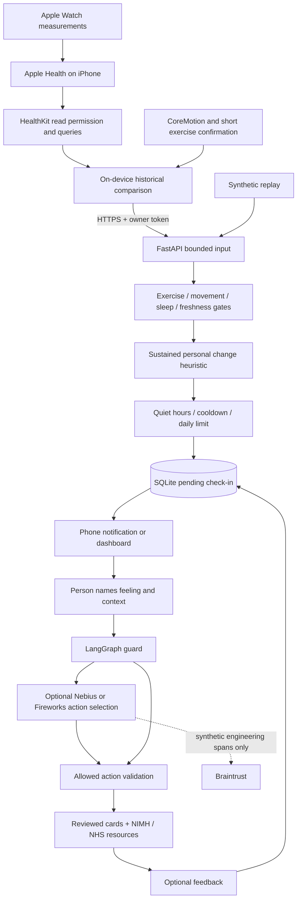

# Architecture and data boundaries

## Signal contract

The experimental `signal-v1` policy needs an inactive exercise context, stationary movement, no sleep, no workout within 45 minutes, at least seven historical days and twenty eligible baseline samples, a baseline updated within seven days, and fresh unique heart-rate samples. The latest three samples must span at least five minutes in the last fifteen minutes, all at or above `baseline median + max(15 bpm, 3 × MAD)`. The newest must be no older than ten minutes. These thresholds are design assumptions, not validated medical thresholds.

Optional recent HRV can corroborate a qualifying change; it cannot independently trigger a prompt. The API supports it, but the initial iPhone bridge does not yet populate HRV features. The bridge requests HRV read access for a subsequent extension; omit that permission when shipping a HR-only pilot. HRV sampling context and breathing sessions can confound comparisons. HRV is never a dehydration or stress diagnosis.

The iPhone baseline excludes sampled movement neighborhoods, sleep/in-bed periods and workout/recovery neighborhoods. HealthKit read denial is indistinguishable from empty data. Missing steps/workouts/sleep can therefore affect the baseline; the signal must remain experimental until permissions, source attribution, time-of-day normalization, medications, illness and real-world contexts are tested.

## Persistence and concurrency

Raw samples exist transiently in requests; they are not persisted. Events retain only decision reason, provenance and an optional check-in ID. Check-ins retain the displayed outcome and voluntary feedback, but not the selected feeling/context or free-text note. SQLite transactions serialize ingest, deduplicate source-qualified event IDs, and reserve a prompt before notification. Server-side notifications are not used: the iPhone receives the response and schedules a local notification with generic copy.

One server process is supported. The reply lock prevents duplicate provider calls within it. Multi-process reply claiming, multi-user identity, high availability, offline resend queues and APNs are not implemented. If the process dies after a provider call but before saving, a retry may make another bounded call. Phone notification retries suppress duplicate IDs; network loss may mean a missed notification. Check-ins expire after two hours and can be resumed through history after app restart.

## Privacy boundaries

| Data | Location | Retention / recipient |
|---|---|---|
| Historical HealthKit samples | iPhone Health store and query memory | Apple's store; controlled by the person |
| Recent window and baseline summary | iPhone → owner's HTTPS server memory | Not stored by Pausewell |
| Free-text note | Browser → owner's server → local safety route | Ephemeral; not persisted, not sent to LLM/tracing |
| Selected feeling/context | Server → selected provider only with consent | Provider terms apply; enum-only request |
| Events, check-ins and feedback | Owner's SQLite file | Seven-day pruning on ingest/history access; explicit delete |
| Engineering traces | Local bounded memory | Maximum 100; reset on restart/delete |
| Synthetic traces/evals | Braintrust when explicitly enabled/run | Separate provider retention and deletion |

No analytics, advertising, embeddings of health records, passive voice recording or automatic sharing. The SQLite file is mode 0600 and parent directory starts 0700. This is filesystem access control, not database encryption: use an encrypted device/volume and private deployment. Local deletion cannot erase external backups, Apple Health, exports or already sent provider data. The project makes no HIPAA/GDPR compliance certification claim.
